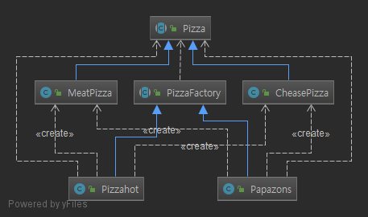

# practice
Java Design Pattern 및 Effective Java 및 알고리즘 풀이를 위한 프로젝트

# Factory Pattern

객체를 생성하기 위한 인터페이스를 정의하는데, 어떤 클래스의 인스턴스를 만들지는 서브클래스에서 결정하게 만든다.
즉 팩토리 메소드 패턴을 이용하면 클래스의 인스턴스를 만드는 일을 서브클래스에게 맡기는 것

###### _Class Diagram of Factory Pattern Example_

**STRATEGY PATTERN**
=

* **행위를 클래스로 캡슐화**해 동적으로 행위를 자유롭게 바꿀 수 있게 해주는 패턴
  * 같은 문제를 해결하는 여러 알고리즘이 클래스별로 캡슐화되어 있고 이들이 필요할 때 교체할 수 있도록 함으로써 동일한 문제를 다른 알고리즘으로 해결할 수 있게 하는 디자인 패턴
  * ‘행위(Behavioral) 패턴’의 하나
* **즉, 전략을 쉽게 바꿀 수 있도록 해주는 디자인 패턴**이다.
  * 전략이란
    * 어떤 목적을 달성하기 위해 일을 수행하는 방식, 비즈니스 규칙, 문제를 해결하는 알고리즘 등

_Class Diagram of the Strategy Pattern Example_

오리의 행위(_비행,울음_)의 변경에 유용
 
###### _RubberDuck create example_
 ~~~
  Duck rd = new RubberDuck();
  rd.setCry(new CryMute());      // 울음소리 변경가능
  rd.setFly(new FlyDisable());   // 비행타입 변경 가능
  rd.display();
 ~~~